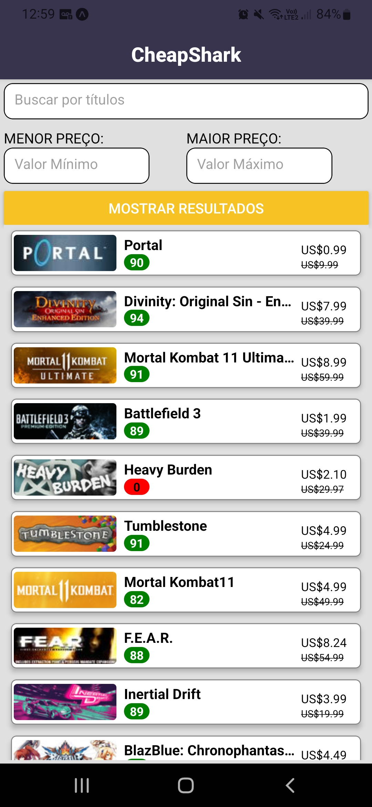
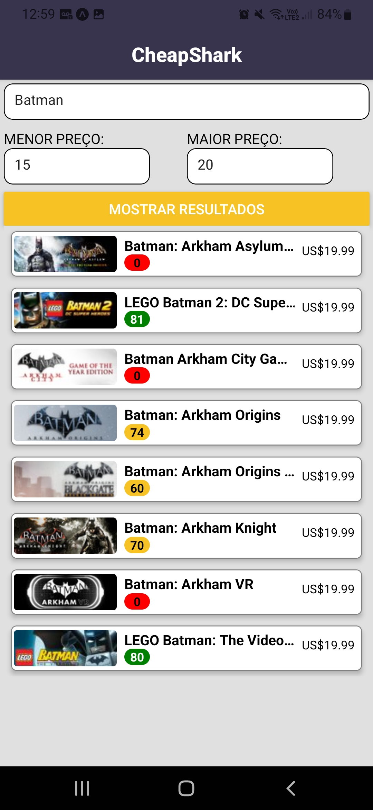
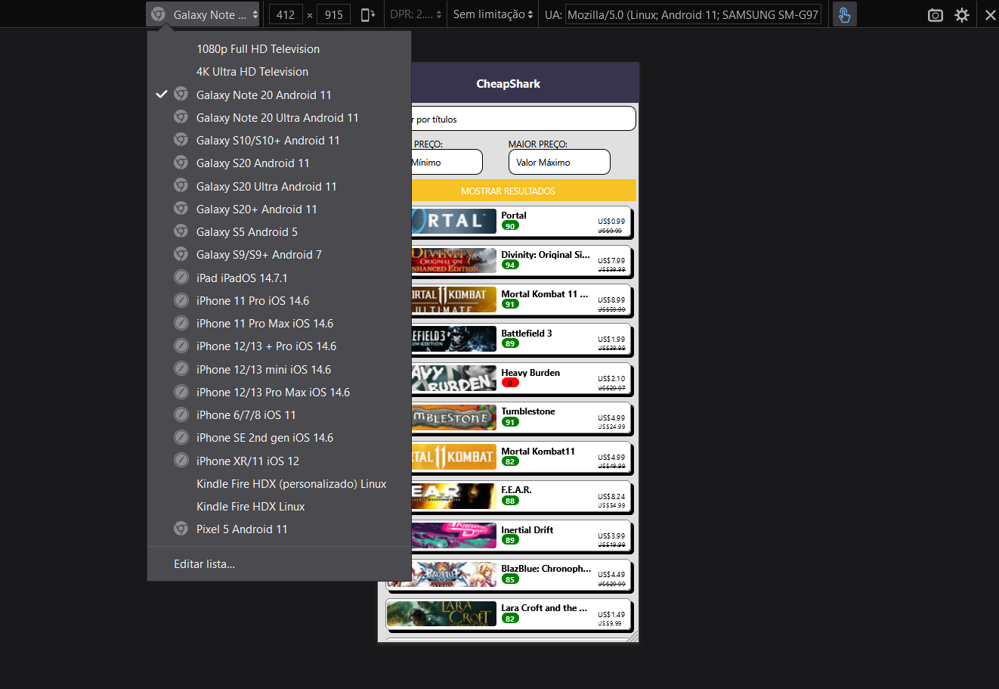
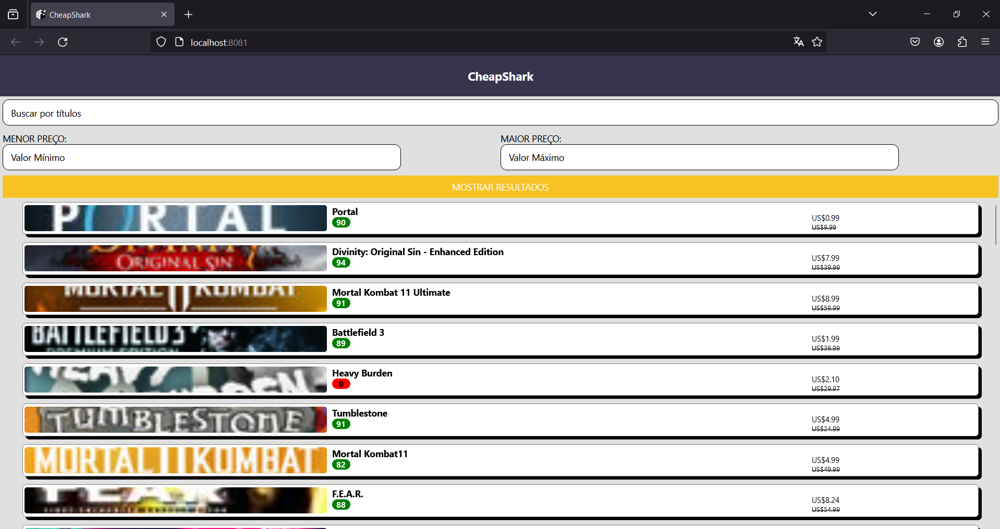

# Project Developed for the TaqTile Internship Challenge - Deals Tracker

This project is a personal solution to the Challenge proposed by TaqTiile

This README describes what was developed during this challenge, including features and functionalities, and what can be further improved in the next steps.

## Requirements

- Use a FlatList component in Search.js; :white_check_mark:

- Implement all styles with styled-components :white_check_mark:

- Create the searchbar and the list using the provided Figma as reference; :white_check_mark:
(Used as reference)

- Use the List of Deals API from Cheap Shark API to search the deals;:white_check_mark:

- The search bar must allow the user to search by name and filter by min and max price; :white_check_mark:

- The list items must contain: the game title, an image, the retail price, the discounted price and the metacritic score :white_check_mark:

## Functionalities of the System

- Search best Deals

If there is nothing in the InputText the app will return the best deals.

- Search best Deals by Title
- Search by filtering the lowest price
- Search by filtering the highest price
- Redirect the user to the corresponding Steam link that was selected

You can press or click any card of any deal, and it will redirect you to the steam link, if you have the steam app downloaded in your smartphone, it will even open the app of the game.

## Features

- Creation of a customizable card to show the title, the image, the metacritic score, the discount price and the normal price.

Utilizing some cards as references it was created a new design for this project, that can be reutilized in the future

- Styling of new Button, Views, TextInputs

It was created new design for all the components used in the project that can be reutilized too.

- Dynamic styling

Used to give the metacritic Score different colors based on its value

- Dynamic hidden text

Used to show the prices, if there is a difference in the discount price and the normal price, the card shows both of them, if not just show the normal price

- Implementation of Stack Navigation

Here it was used to autofill the top of the screen, for some reason, without the head bar the items invade the space of the top bar of the phone system.

It is the only dependence that has to be included in the project.

	npm install @react-navigation/native-stack

- Conexion with the Cheap Shark API to get the searched deals

It was made with a simple fetch function, utilizing a get method, and returned a .json file that was handled by the function getGames() and showed using a FlatList.

## Interface

|

## Further Improvement

### Add orderBy

This is a simple step that could be added to the top of the app, and it's very simple and used in all searching websites. It could order by title, price, metacritic score (already possible using just the API), using a drop-down to select possibly.

### Add more details to the cards

It could open a pop-up or a new screen where there is more information about the deal, like the link, the store, the Steam Rating, the Release Data, and other information.
Showing directly the steamLink isn't ideal, adding this intermediate page would be better (using the imported dependence Stack Navigation).

### Deal Lookup

It can be implemented in the same part as the last topic, maybe shown in this new page. Adding this new method, there are some new information about the game that can be shown, like the price in all the stores (in the Cheap Shark), and show the cheapest one.

## Improve the interface

For some screen proportions, there are some problems that appear in the cards. For most of the screens tested, there isn't any problem, they show all the necessary information, but for some phones tested using the web browser, the prices aren't shown fully, example below:

It didn't work for Samsung Galaxy s20 and s9, for all the others, all the information are shown fully.

## Improve the web Browser interface

The app was developed focusing the android and iOS interface. There are some corrections needed so that the app can be used in browser. Example below:

